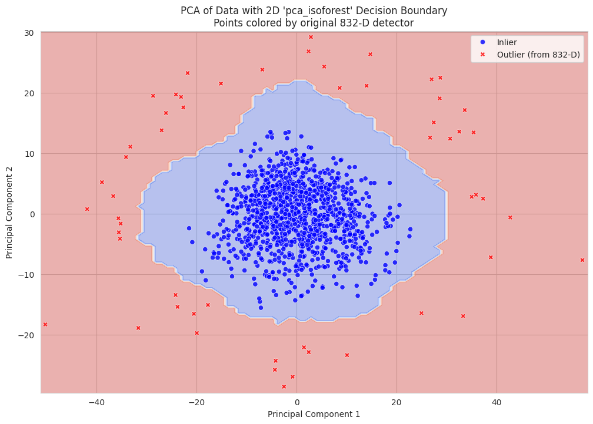

# Predict person's age from brain image data

## Task

### Filling Missing Values

### Outlier Detection

The following methods were considered for outlier detection:
z-score, knn, isolation forest, svm, pca with svm, pca with isoforest.

The current implementation uses 2 principal components together with Isolation Forest for outlier detection.



### Feature Selection

### Age Prediction Model

Regression task requiring prediction of a person's age based on brain image data.


## Evaluation Metrics

**Coefficient of Determination (R² Score)**
is the proportion of the variance in the dependent variable that is predictable from the independent variables.
$R^2 \in (-\infty, 1]$, with 1 indicating perfect prediction.

$R^2 := 1 - \frac{SS_{res}}{SS_{tot}}$

$SS_{tot} := \sum_{i} (y_i - \overline{y})^2$

$SS_{res} := \sum_{i} (f_i - y_i)^2$

## Setup

The python dependencies are in listed in `requirements.txt` file. 
The project manager for python and dependencies versioning is uv. 

To setup the environment, install uv and run

```bash
make setup
```

To activate the jupyter notebook, run

```bash
make start-notebook
```

The `pyproject.toml` file is used to manage the project metadata and dependencies.
It is the standard used by uv to manage the project.


